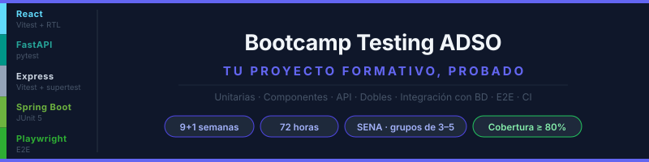

  

  

# ADSO Testing Bootcamp

A software testing bootcamp built around the **capstone project** of SENA's **Software Analysis and Development (ADSO)** program in Colombia. It targets 6th-term apprentices who already have a project in progress and have **one term (9–10 weeks, 8 h/week)** to give it a real test suite.

Each week covers **one shared topic** with **recipes per stack**, so every team applies it to its own project:

| Layer | Stacks | Test tools |
|---|---|---|
| Frontend | React (Vite) | Vitest + React Testing Library |
| Backend | FastAPI | pytest + `TestClient` |
| Backend | Express | Vitest + supertest |
| Backend | Spring Boot | JUnit 5 + MockMvc + AssertJ |
| Database | PostgreSQL or MySQL | Docker Compose |
| E2E | Any combination | Playwright |

## Syllabus

| Wk | Topic |
|:---:|---|
| 1 | Why test + **first Playwright E2E** on your project |
| 2 | Unit tests with AAA + **coverage threshold in CI** |
| 3 | React components with React Testing Library |
| 4 | API tests: status codes, validation, errors |
| 5 | Test doubles: mocks and stubs |
| 6 | Integration with a real DB (Docker Compose) |
| 7 | Playwright in depth: critical flows and test data |
| 8 | Full CI (DB, integration, E2E) and suite quality |
| 9 | **Capstone**: full suite and oral defense |
| 10 | *(Optional)* TDD on a new user story |

## Quality is mandatory

Coverage is measured from week 1. From week 2 on, GitHub Actions rejects any PR below the weekly threshold, which rises to **80%** of business logic and never goes down.

## Team learning

Teams of 3–5 tend to split roles, leaving some members without key skills. Four mechanisms prevent that: **layer rotation**, **per-person commit evidence**, a **random spokesperson** at each weekly review, and **cross-layer PR review**. See [docs/guia-instructor.md](docs/guia-instructor.md) (Spanish).

Course content is in Spanish. License: [CC BY-NC-SA 4.0](LICENSE).

---

## Navigation

| ← Previous | Home | Next → |
|---|---|---|
| — | ADSO Testing Bootcamp | [Week 1 (Spanish)](bootcamp/week-01-por_que_probar_y_primer_e2e/README.md) · [Study plan (Spanish)](docs/plan-estudios.md) |
