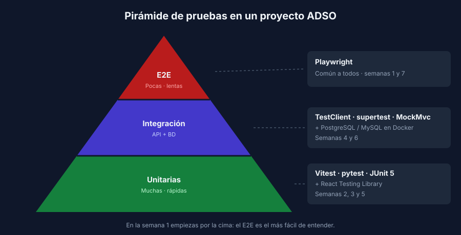

# La pirámide de pruebas y el patrón AAA

> Transversal: aplica a todos los stacks.

## Tres niveles de prueba



| Nivel | Qué prueba | Velocidad | Ejemplo en tu proyecto |
|---|---|---|---|
| **Unitaria** | Una función o componente, aislado del resto | Milisegundos | "El descuento no puede superar el 50%" |
| **Integración** | Varias piezas juntas: API + BD, componente + API | Décimas de segundo a segundos | "`POST /api/users` guarda el usuario en PostgreSQL" |
| **E2E** (extremo a extremo) | La app completa, como la usa una persona | Segundos | "Me registro, inicio sesión y veo mi perfil" |

La forma de pirámide indica **cuántas** pruebas conviene tener de cada nivel:

- **Muchas unitarias**: son rápidas, baratas y señalan exactamente qué se rompió.
- **Algunas de integración**: verifican que las piezas encajan (el SQL es válido, el JSON tiene la forma correcta).
- **Pocas E2E**: son las más convincentes, pero también las más lentas y frágiles. Cubre solo los flujos críticos.

> ⚠️ El antipatrón es el **cono de helado**: casi todo se prueba a mano o con E2E, y casi nada con pruebas unitarias. La suite se vuelve lenta, y cuando algo falla no sabes dónde está el problema.

## Dónde vive cada nivel en tu stack

| Nivel | React | FastAPI | Express | Spring Boot |
|---|---|---|---|---|
| Unitaria | Vitest + React Testing Library | pytest | Vitest | JUnit 5 + AssertJ |
| Integración (API) | — | `TestClient` | supertest | MockMvc |
| Integración (BD) | — | pytest + BD en Docker | Vitest + BD en Docker | JUnit + BD en Docker |
| E2E | Playwright (común a todos) | | | |

Durante el bootcamp recorres la pirámide completa, pero **empiezas por la cima** (E2E), porque es la prueba más fácil de entender: hace exactamente lo que harías tú a mano.

## El patrón AAA

Todo test bien escrito, en cualquier nivel y lenguaje, tiene tres partes:

1. **Arrange** (preparar): los datos y el estado inicial.
2. **Act** (actuar): la acción que quieres probar. Idealmente una sola.
3. **Assert** (verificar): comprobar que el resultado es el esperado.

**E2E (Playwright)**

```javascript
test('should show the new piece in the list after saving the form', async ({ page }) => {
  // Arrange
  await page.goto('/');

  // Act
  await page.getByLabel('Nombre').fill('Guernica');
  await page.getByRole('button', { name: 'Guardar' }).click();

  // Assert
  await expect(page.getByRole('list')).toContainText('Guernica');
});
```

**Unitaria (pytest, FastAPI)**

```python
def test_validate_piece_raises_error_when_year_is_in_the_future():
    # Arrange
    data = {"name": "Future", "artist": "Nobody", "year": 2027}

    # Act + Assert: pytest.raises verifica que la acción lance el error
    with pytest.raises(ValidationError):
        validate_piece(data, current_year=2026)
```

**Unitaria (JUnit 5, Spring Boot)**

```java
@Test
@DisplayName("should return trimmed piece when request is valid")
void shouldReturnTrimmedPieceWhenRequestIsValid() {
    // Arrange
    var request = new PieceRequest("  Guernica ", "Picasso", 1937);

    // Act
    Piece piece = PiecesService.validate(request, 2026);

    // Assert
    assertThat(piece.getName()).isEqualTo("Guernica");
}
```

Fíjate en que la estructura es idéntica aunque cambien el lenguaje y el nivel. Si dominas AAA, puedes leer los tests de cualquier capa de tu grupo.

## Un test debe poder fallar

Un test que siempre pasa no protege nada. Por eso, cada vez que escribas un test:

1. Hazlo pasar.
2. **Rompe a propósito** el código (o cambia el valor esperado) y comprueba que el test falla.
3. Deshaz el cambio.

Si el test no falla en el paso 2, no está verificando lo que crees. Este hábito es parte de la checklist de todos tus PR.

## Nombres que documentan

El nombre de un test dice qué comportamiento se espera y en qué condición:

- ✅ `should show an error when name is empty`
- ✅ `test_create_piece_responds_422_when_name_is_blank`
- ❌ `test1`, `shouldWork`, `testForm`

Cuando el test falle, su nombre te dirá qué regla se rompió sin tener que leer el código.
