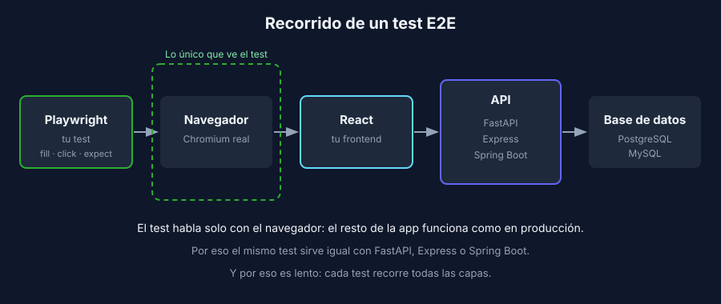

# Anatomía de un test E2E con Playwright

> Común a todos los stacks: Playwright habla con el navegador, no con tu backend.

## Qué es Playwright

[Playwright](https://playwright.dev) es una herramienta que controla un navegador real (Chromium, Firefox o WebKit) desde código. Tu test abre la página, escribe en los campos, hace clic y verifica lo que aparece en pantalla, como lo haría una persona.

Como solo ve el navegador, **da igual si tu backend es FastAPI, Express o Spring Boot**: el mismo test sirve para cualquier grupo con frontend React.



## Las piezas de un test

```javascript
import { expect, test } from '@playwright/test';

test('should show an error when name is empty', async ({ page }) => {
  await page.goto('/');

  await page.getByLabel('Artista').fill('Anónimo');
  await page.getByRole('button', { name: 'Guardar' }).click();

  await expect(page.getByRole('alert')).toHaveText('El nombre es obligatorio');
});
```

| Pieza | Para qué sirve |
|---|---|
| `test('nombre', async ({ page }) => …)` | Declara un test. Playwright te entrega una pestaña nueva y limpia (`page`) |
| `page.goto('/')` | Navega a una ruta, relativa a la `baseURL` de la configuración |
| `page.getByLabel(...)`, `page.getByRole(...)` | **Locators**: encuentran elementos como los encuentra una persona |
| `.fill()`, `.click()` | **Acciones**: escribir, hacer clic, seleccionar |
| `expect(locator).toHaveText(...)` | **Aserción**: verifica el resultado y espera a que se cumpla |

## Locators: busca como busca una persona

Una persona no busca "el `div` con la clase `btn-primary-2`"; busca "el botón que dice Guardar". Playwright recomienda lo mismo:

| Prioridad | Locator | Ejemplo |
|---|---|---|
| 1 | `getByRole` | `page.getByRole('button', { name: 'Guardar' })` |
| 2 | `getByLabel` | `page.getByLabel('Correo electrónico')` |
| 3 | `getByPlaceholder`, `getByText` | `page.getByText('Bienvenido')` |
| Último recurso | `getByTestId` | `page.getByTestId('user-card')` |

Si un elemento no se puede encontrar por rol o por etiqueta, muchas veces es una señal de un problema de **accesibilidad** en tu frontend: por ejemplo, un `<input>` sin `<label>`. Corregirlo mejora a la vez tus tests y tu aplicación.

> ❌ Evita selectores CSS como `page.locator('.form > div:nth-child(2) input')`. Se rompen apenas alguien cambia el diseño.

## Espera automática: nada de `sleep`

Tu frontend hace peticiones al API y tarda en mostrar el resultado. Playwright lo sabe:

- Antes de hacer clic, **espera** a que el botón exista, sea visible y esté habilitado.
- Las aserciones con `await expect(...)` **reintentan** hasta que se cumplen o se agota el tiempo (5 segundos por defecto).

```javascript
// ✅ Espera lo necesario y ni un milisegundo más
await expect(page.getByRole('list')).toContainText('Guernica');

// ❌ Lento cuando sobra tiempo, y falla igual cuando falta
await page.waitForTimeout(3000);
```

## Codegen: graba primero, limpia después

No tienes que escribir el test desde cero. `playwright codegen` abre un navegador y **genera el código** mientras usas la app:

```bash
pnpm exec playwright codegen http://localhost:5173
```

El código generado es un borrador, no un test terminado:

1. **Le faltan aserciones.** Codegen graba acciones; tú decides qué verificar al final.
2. **A veces elige mal los locators.** Cámbialos por `getByRole` o `getByLabel` cuando sea posible.
3. **No tiene estructura.** Organízalo en AAA y ponle un nombre que describa el comportamiento.

## La configuración

`playwright.config.js` define, entre otras cosas:

- `baseURL`: la dirección del frontend, para escribir `page.goto('/')`.
- `webServer`: el comando que levanta el frontend antes de los tests.
- `projects`: los navegadores en los que corre la suite.

El backend y la base de datos los levantas tú antes de correr los tests. En la semana 7 verás cómo preparar datos de prueba y automatizar todo el entorno.

## Comandos del día a día

| Comando | Qué hace |
|---|---|
| `pnpm exec playwright test` | Corre toda la suite sin ventana (headless) |
| `pnpm exec playwright test --headed` | Corre mostrando el navegador |
| `pnpm exec playwright test --ui` | Modo interactivo: paso a paso, con línea de tiempo |
| `pnpm exec playwright show-report` | Abre el reporte HTML de la última ejecución |

---

## Navegación

| ← Anterior | Inicio | Siguiente → |
|---|---|---|
| [La pirámide de pruebas y el patrón AAA](02-piramide-y-aaa.md) | [Semana 1](../README.md) | [Receta — Playwright contra la app de referencia](../2-recetas/playwright/README.md) |
