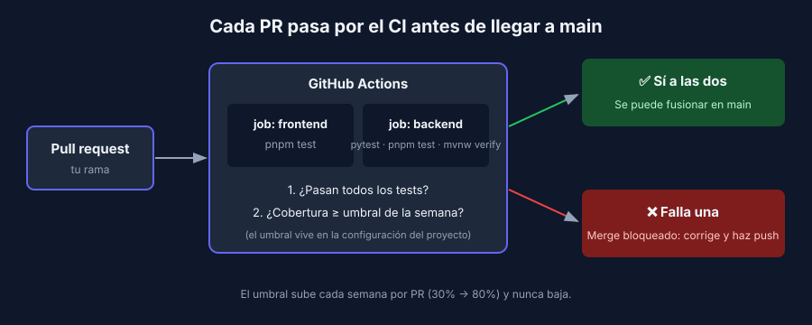

# Integración continua con GitHub Actions

> Transversal: aplica a todos los stacks.

## El problema

La semana pasada configuraste un umbral de cobertura. Pero ese umbral solo protege si alguien corre los tests. En un grupo de cinco personas, alguien siempre hace push sin correrlos "porque era un cambio pequeño".

La **integración continua (CI)** resuelve eso: un servidor corre los tests **automáticamente** en cada push y en cada pull request. Si fallan, o si la cobertura baja del umbral, el PR queda marcado en rojo y no se fusiona.

## GitHub Actions en 5 conceptos

| Concepto | Qué es |
|---|---|
| **Workflow** | Archivo YAML en `.github/workflows/`. Define cuándo y qué se ejecuta |
| **Evento** (`on`) | Lo que dispara el workflow: `push`, `pull_request` |
| **Job** | Un conjunto de pasos que corre en una máquina virtual limpia (`runs-on: ubuntu-latest`) |
| **Step** | Un paso: usar una acción (`uses`) o ejecutar un comando (`run`) |
| **Acción** | Paso reutilizable publicado por otros: `actions/checkout`, `actions/setup-node`… |

Los jobs de un workflow corren **en paralelo**: frontend y backend se prueban al mismo tiempo.



## Anatomía de un workflow

```yaml
name: tests

on:
  push:
    branches: [main]
  pull_request:

jobs:
  backend:
    runs-on: ubuntu-latest
    defaults:
      run:
        working-directory: backend       # carpeta del backend en tu repo
    steps:
      - uses: actions/checkout@v7.0.1    # 1. descarga el código
      - uses: astral-sh/setup-uv@v10.2.0 # 2. instala las herramientas
      - run: uv sync                     # 3. instala las dependencias
      - run: uv run pytest               # 4. tests + umbral de cobertura
```

Fíjate en el paso 4: es **el mismo comando que corres en local**. Como el umbral ya vive en la configuración del proyecto (`pyproject.toml`, `vitest.config.js`, `pom.xml`), el CI no necesita saber nada de cobertura: si el comando falla, el job falla.

> 📌 Las versiones de las acciones (`@v7.0.1`) van fijadas en exacto, por la misma razón que las dependencias: builds reproducibles y control sobre lo que se ejecuta.

## El modelo: el CI de la referencia

Este repositorio corre su propio CI en [`.github/workflows/referencia.yml`](../../../.github/workflows/referencia.yml): un job por app, cada uno con su comando de test. Tu workflow será una versión reducida con solo los stacks de tu proyecto.

## Rojo o verde: cómo leer el resultado

- En el PR, al final de la conversación, aparece la lista de **checks** con ✅ o ❌.
- Haz clic en **Details** para ver el log del job que falló. El error es el mismo que verías en tu terminal.
- La pestaña **Actions** del repo muestra el historial de todas las ejecuciones.

## Que el rojo bloquee de verdad

Un check en rojo es solo un aviso si alguien puede fusionar igual. Para bloquear el botón de merge se configura una **regla de rama** en GitHub:

**Settings → Rules → Rulesets → New branch ruleset**, sobre la rama `main`, con:

- ✅ *Require a pull request before merging*
- ✅ *Require status checks to pass*, agregando los jobs de tu workflow

> ⚠️ En cuentas gratuitas, las reglas de rama solo se aplican en **repos públicos**. Si el repo del grupo es privado, tienen dos caminos: hacerlo público, o que la persona dueña del repo solicite el [GitHub Student Developer Pack](https://education.github.com/pack), que incluye GitHub Pro. Mientras tanto, la regla del grupo es explícita: **nadie fusiona un PR en rojo**, y el instructor lo verifica en la pestaña Actions.

## El umbral y el CI juntos

| Momento | Qué exige el CI |
|---|---|
| Durante la semana | El umbral vigente (al inicio de la semana 2, tu línea base) |
| Cierre de la semana 2 | Un PR sube el umbral a **30%** o a tu cobertura real si es mayor, y el CI debe quedar en verde con ese valor |
| Cada semana siguiente | Lo mismo con el piso de esa semana, hasta el 80% |

Así el umbral sube con PR, queda registrado en el historial de Git y nunca baja sin que el grupo lo vea.

## Errores frecuentes

- **Funciona en mi máquina, falla en CI**: la máquina del CI está limpia. Falta una dependencia en el `package.json` o el `pyproject.toml`, o el test depende de un archivo local o de una variable de entorno que no existe en el CI.
- **`working-directory` equivocado**: el job no encuentra el `package.json`. Revisa la ruta relativa a la raíz del repo.
- **`mvnw: Permission denied`**: el wrapper perdió el permiso de ejecución. Corre `git update-index --chmod=+x mvnw` y haz commit.

---

## Navegación

| ← Anterior | Inicio | Siguiente → |
|---|---|---|
| [Diseño de casos: particiones, valores límite y tests parametrizados](02-diseno-de-casos.md) | [Semana 2](../README.md) | [Receta — Lógica pura del frontend React con Vitest](../2-recetas/react/README.md) |
