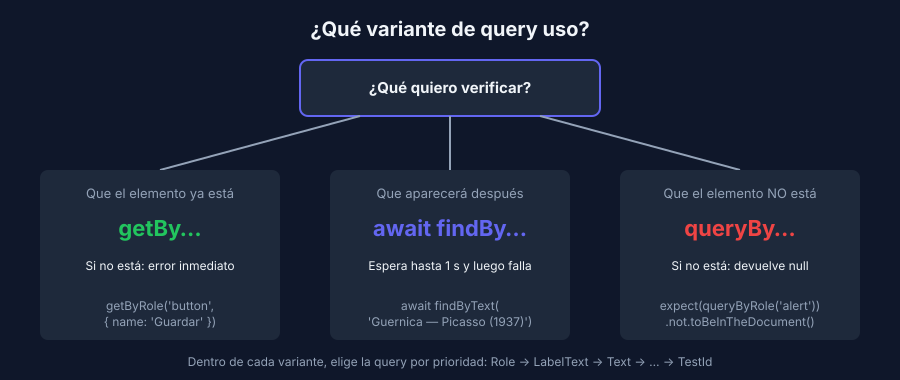

# Probar como la persona usuaria: render y queries

> React · Vitest + React Testing Library

## La idea central

> *"Cuanto más se parezcan tus tests a la forma en que se usa tu software, más confianza te pueden dar."* — principio guía de Testing Library

La persona que usa tu app no sabe qué estado tiene un componente ni cómo se llama una función interna. Ve textos, botones y campos, y actúa sobre ellos. React Testing Library (RTL) te obliga a probar desde ese mismo lugar: si refactorizas el componente sin cambiar lo que se ve, los tests siguen pasando.

## Las piezas

| Pieza | De dónde viene | Para qué |
|---|---|---|
| `render(<Componente />)` | `@testing-library/react` | Monta el componente en un DOM simulado (jsdom) |
| `screen` | `@testing-library/react` | Consulta todo lo que se ve en ese DOM |
| `userEvent` | `@testing-library/user-event` | Simula escribir, hacer clic, tabular… |
| `toBeInTheDocument()`, `toHaveValue()`… | `@testing-library/jest-dom` | Aserciones sobre el DOM |

La configuración ya está en la referencia: `environment: 'jsdom'` en [`vite.config.js`](../../../referencia/frontend-react/vite.config.js), y los matchers de jest-dom junto con la limpieza entre tests en [`tests/setup.js`](../../../referencia/frontend-react/tests/setup.js).

```jsx
import { render, screen } from '@testing-library/react';
import PieceForm from '../src/PieceForm.jsx';

it('should render the save button', () => {
  render(<PieceForm onSubmit={() => {}} />);

  expect(screen.getByRole('button', { name: 'Guardar' })).toBeInTheDocument();
});
```

## Prioridad de queries

Usa la primera que funcione. Es el mismo criterio que usaste con Playwright en la semana 1:

| Prioridad | Query | Encuentra por… |
|---|---|---|
| 1 | `getByRole('button', { name: 'Guardar' })` | Rol accesible y nombre visible |
| 2 | `getByLabelText('Nombre')` | La etiqueta de un campo de formulario |
| 3 | `getByPlaceholderText`, `getByText`, `getByDisplayValue` | Texto visible |
| 4 | `getByAltText`, `getByTitle` | Atributos de accesibilidad |
| Último recurso | `getByTestId('piece-card')` | Un `data-testid` que la persona usuaria no ve |

Roles frecuentes: `button`, `textbox`, `spinbutton` (input numérico), `checkbox`, `combobox` (select), `link`, `heading`, `list`, `listitem`, `alert`, `dialog`.

> 💡 ¿No sabes qué rol tiene un elemento? Escribe `screen.debug()` dentro del test para ver el HTML renderizado, o `screen.logTestingPlaygroundURL()` para abrir un sitio web que sugiere la mejor query.

## Tres variantes de cada query

| Variante | Si no encuentra el elemento | Si encuentra varios | Úsala para… |
|---|---|---|---|
| `getBy…` | Lanza error | Lanza error | Elementos que **deben** estar ya |
| `queryBy…` | Devuelve `null` | Lanza error | Comprobar que algo **no** está |
| `findBy…` | Espera (1 s por defecto) y luego lanza error | Lanza error | Elementos que **aparecen después** (asíncronos) |



Cada una tiene su versión en plural (`getAllBy…`, `queryAllBy…`, `findAllBy…`) que devuelve un arreglo.

```jsx
// Debe estar
expect(screen.getByRole('heading', { name: 'Museo' })).toBeInTheDocument();

// No debe estar
expect(screen.queryByRole('alert')).not.toBeInTheDocument();

// Aparecerá cuando responda el API
expect(await screen.findByText('Guernica — Picasso (1937)')).toBeInTheDocument();
```

> ⚠️ `expect(screen.getByRole('alert')).not.toBeInTheDocument()` **nunca pasa**: si el elemento no existe, `getBy` lanza el error antes de llegar al `expect`. Para ausencias usa siempre `queryBy`.

## Buscar dentro de una parte de la pantalla

Cuando hay varios elementos iguales (un botón "Eliminar" por fila), limita la búsqueda con `within`:

```jsx
import { within } from '@testing-library/react';

const list = screen.getByRole('list', { name: 'Piezas' });
expect(within(list).getAllByRole('listitem')).toHaveLength(2);
```

## Matchers de jest-dom más usados

| Matcher | Verifica que… |
|---|---|
| `toBeInTheDocument()` | El elemento está en la página |
| `toHaveTextContent('…')` | Contiene ese texto |
| `toHaveValue('…')` | Un campo tiene ese valor (`null` en un input numérico vacío) |
| `toBeVisible()` | Se ve (no está oculto con CSS ni con `hidden`) |
| `toBeDisabled()` / `toBeEnabled()` | Un botón o campo está deshabilitado o habilitado |
| `toBeChecked()` | Un checkbox o radio está marcado |
| `toHaveAccessibleName('…')` | Tiene ese nombre accesible |

## Accesibilidad y testabilidad son lo mismo

Si un `<input>` no tiene `<label>` asociado, `getByLabelText` no lo encuentra y **un lector de pantalla tampoco**. Cuando una query accesible no funciona, el problema suele estar en el componente, no en el test. Corregirlo mejora ambas cosas a la vez.
