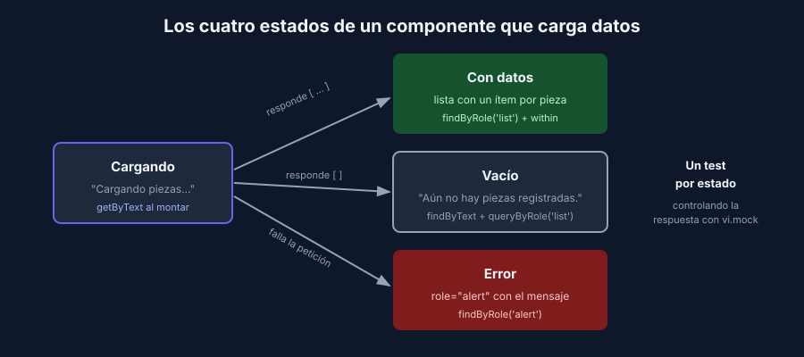

# Qué probar en un componente (y qué no)

> React · Vitest + React Testing Library

## Probar comportamiento, no implementación

| ✅ Prueba | ❌ No pruebes |
|---|---|
| Qué texto, campos y botones ve la persona | El valor de un `useState` |
| Qué pasa al escribir, hacer clic o enviar | Cuántas veces se renderizó el componente |
| Mensajes de validación y de error | Nombres de clases CSS o estilos |
| Estados de carga, vacío y error | Que se llamó a un hook o a una función interna |
| Con qué datos se llama a un callback (`onSubmit`) | Detalles que la persona no percibe |

Pregunta de control: **si refactorizo el componente sin cambiar lo que se ve, ¿el test se rompe?** Si la respuesta es sí, el test está atado a la implementación.

## Los estados que siempre se olvidan

Todo componente que carga datos tiene al menos cuatro estados. Pruébalos todos:



| Estado | Ejemplo en la referencia | Qué verificar |
|---|---|---|
| Cargando | "Cargando piezas…" | Aparece al montar y desaparece al responder |
| Vacío | "Aún no hay piezas registradas." | Se muestra con una lista vacía y no aparece la lista |
| Con datos | La lista de piezas | Un elemento por dato, con el texto correcto |
| Error | `role="alert"` con el mensaje | Se muestra el mensaje y no el estado vacío |

La app de referencia tiene **100% de cobertura** en `App.jsx` y, sin embargo, ningún test verifica el mensaje de carga ni el de lista vacía. Podrías borrarlos y todos los tests seguirían en verde. Lo compruebas en la receta.

## Snapshots: con cuidado

`expect(container).toMatchSnapshot()` guarda el HTML completo y falla si cambia cualquier cosa. Parece cómodo, pero:

- Falla con cada cambio de diseño, aunque el comportamiento esté bien.
- Cuando falla, la tentación es actualizarlo sin leer la diferencia (`vitest -u`).
- No dice **qué** es importante del componente.

Prefiere aserciones explícitas sobre lo que importa. Si usas un snapshot, que sea pequeño (`toMatchInlineSnapshot` sobre un solo elemento).

## Componentes con rutas (React Router)

Si el componente usa `useNavigate`, `Link` o `useParams`, necesita un router en el test. Usa `MemoryRouter`, que no depende de la barra de direcciones:

```jsx
import { MemoryRouter, Route, Routes } from 'react-router';

render(
  <MemoryRouter initialEntries={['/pieces/1']}>
    <Routes>
      <Route path="/pieces/:id" element={<PieceDetail />} />
    </Routes>
  </MemoryRouter>,
);
```

> Según la versión de tu proyecto, el paquete puede ser `react-router` o `react-router-dom`. Importa desde el mismo que usa tu código.

## Componentes con contexto (autenticación, tema, carrito)

Si el componente lee un contexto (`useAuth()`), envuélvelo con el proveedor y un valor controlado. Para no repetir el envoltorio en cada test, crea tu propio `render`:

```jsx
// tests/render-with-providers.jsx
import { render } from '@testing-library/react';
import { MemoryRouter } from 'react-router';
import { vi } from 'vitest';
import { AuthContext } from '../src/auth/AuthContext.jsx';

export function renderWithProviders(ui, { user = null, route = '/' } = {}) {
  return render(
    <AuthContext.Provider value={{ user, login: vi.fn(), logout: vi.fn() }}>
      <MemoryRouter initialEntries={[route]}>{ui}</MemoryRouter>
    </AuthContext.Provider>,
  );
}
```

```jsx
it('should show the logout button when user is logged in', () => {
  renderWithProviders(<Navbar />, { user: { name: 'Ana' } });

  expect(screen.getByRole('button', { name: 'Cerrar sesión' })).toBeInTheDocument();
});
```

Ajusta los nombres (`AuthContext`, sus valores) a los de tu proyecto. La idea es la misma para cualquier proveedor: carrito, tema o idioma.

## Qué componentes de tu proyecto probar primero

1. **Formularios**: login, registro y creación del recurso principal. Concentran validaciones y errores.
2. **Listas con estados**: carga, vacío, datos, error.
3. **Rutas protegidas**: con usuario, redirige o muestra el contenido; sin usuario, no.
4. **Componentes con lógica condicional**: botones que se deshabilitan, secciones que solo ve un rol.

Deja para el final los componentes puramente visuales (encabezados, tarjetas sin lógica): aportan poco.

---

## Navegación

| ← Anterior | Inicio | Siguiente → |
|---|---|---|
| [Interacción y asincronía](02-interaccion-y-asincronia.md) | [Semana 3](../README.md) | [Receta — React Testing Library contra la app de referencia](../2-recetas/react/README.md) |
