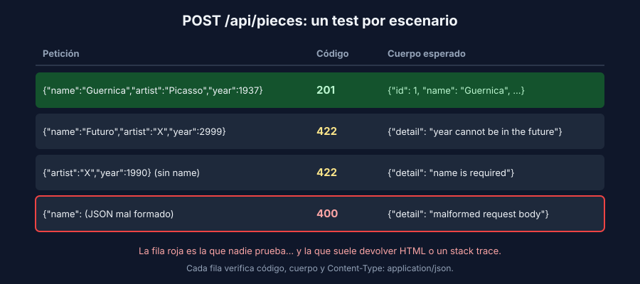

# El contrato HTTP

> Backend: aplica a FastAPI, Express y Spring Boot.

## Qué es una prueba de API

Una prueba de API envía una petición HTTP a tu backend y verifica la respuesta. A diferencia de la prueba unitaria, recorre **todo el camino web**: la ruta, la lectura y validación del JSON, el servicio, la traducción de errores a códigos HTTP y la serialización de la respuesta.

| | Unitaria (semana 2) | API (esta semana) | E2E (semanas 1 y 7) |
|---|---|---|---|
| Qué ejecuta | Una función del servicio | Ruta → validación → servicio → respuesta | Navegador → front → API → BD |
| Base de datos | No | **No**: repositorio falso o servicio simulado | Sí |
| Velocidad | Milisegundos | Milisegundos | Segundos |
| Detecta | Reglas de negocio mal implementadas | Rutas, códigos de estado y formato del JSON incorrectos | Que el sistema completo no funciona |

## El contrato

Lo que el frontend espera de cada endpoint. Tiene tres partes y **las tres** se prueban:

1. **Código de estado**: `201`, `404`, `422`…
2. **Cuerpo**: la forma del JSON y los valores importantes.
3. **Encabezados**: sobre todo `Content-Type: application/json`.

El contrato de la app de referencia está en su [README](../../../referencia/README.md#el-api).

## Qué código para qué escenario

| Escenario | Código | Ejemplo |
|---|---|---|
| Lectura exitosa | `200 OK` | `GET /api/pieces` |
| Creación exitosa | `201 Created` | `POST /api/pieces` |
| Eliminación exitosa, sin cuerpo | `204 No Content` | `DELETE /api/pieces/1` |
| JSON mal formado | `400 Bad Request` | `{"name":` |
| Sin autenticar | `401 Unauthorized` | Sin token o con token vencido |
| Autenticado sin permiso | `403 Forbidden` | Un aprendiz intenta borrar usuarios |
| Recurso inexistente | `404 Not Found` | `GET /api/pieces/999` |
| Conflicto con el estado actual | `409 Conflict` | Correo ya registrado |
| Datos válidos como JSON, pero que rompen una regla | `422 Unprocessable Content` | Año en el futuro |
| Error inesperado del servidor | `500 Internal Server Error` | Nunca debería ser a propósito |

> Algunos equipos usan `400` también para errores de validación. Lo importante no es elegir entre `400` y `422`, sino **ser consistentes** y que el test lo fije.



## Por cada endpoint, al menos estos casos

- ✅ **Caso feliz**: código y cuerpo esperados.
- ✅ **Validación**: un dato inválido devuelve el error con el formato del contrato.
- ✅ **Inexistente**: un id que no existe devuelve `404`.
- ✅ **Mal formado**: un cuerpo que no es JSON válido devuelve un error **controlado**.
- ✅ **Protegido** (si aplica): sin token → `401`; con un rol insuficiente → `403`.

## El error también es parte del contrato

El frontend tiene que mostrarle algo útil a la persona cuando falla una petición. Si cada error llega con un formato distinto, el front no puede manejarlos. Un contrato de errores simple:

```json
{ "detail": "piece not found" }
```

Siempre JSON, siempre con la misma clave, y un código de estado coherente.

## El defecto que casi todas las APIs tienen

Envía un JSON mal formado a una API sin pruebas de este caso y es común recibir esto:

```html
<!DOCTYPE html>
<html lang="en">
<pre>SyntaxError: Unexpected end of JSON input<br> &nbsp; &nbsp;at JSON.parse (&lt;anonymous&gt;)<br> &nbsp; &nbsp;at parse (/home/…
```

Esta es la respuesta real de la API Express de la referencia. Tiene tres problemas:

1. **Rompe el contrato**: el front espera JSON y recibe HTML.
2. **Filtra información interna**: rutas del servidor, librerías y versiones. Un atacante aprende de tu sistema sin esfuerzo.
3. **Nadie lo vio**, porque todos los tests enviaban JSON válido.

FastAPI y Spring Boot no devuelven HTML, pero tampoco respetan el formato `{"detail": "..."}`. Lo descubres y lo corriges en la receta de tu stack.

> ⚠️ **Seguridad**: una respuesta de error nunca debe incluir stack traces, consultas SQL, rutas de archivos ni mensajes internos de la base de datos. Pruébalo como cualquier otro requisito.

## Qué no probar aquí

- Las reglas de negocio en detalle: ya las cubren las pruebas unitarias. Aquí basta un caso por regla para verificar que el error se traduce al código correcto.
- El framework en sí: no pruebes que FastAPI convierte JSON en diccionarios. Prueba **tu** contrato.
- La base de datos: las consultas reales se prueban con integración en la semana 6.
