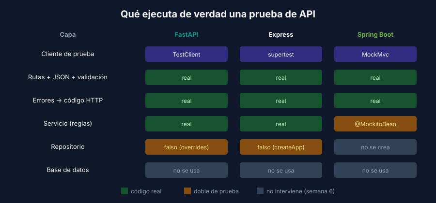

# Pruebas de API en cada stack

> Backend: cada sección indica su stack.

Los tres stacks hacen lo mismo: envían una petición a la app **sin abrir un puerto** y reemplazan lo que está detrás del servicio para no necesitar la base de datos.



## FastAPI: `TestClient` y `dependency_overrides`

`TestClient` envía peticiones directamente a la app. Para no usar la BD, se reemplaza la **dependencia** que entrega el repositorio:

```python
# tests/conftest.py
@pytest.fixture
def client(repository):
    app.dependency_overrides[get_repository] = lambda: repository   # repositorio falso
    yield TestClient(app)
    app.dependency_overrides.clear()                                # limpia al terminar
```

```python
# tests/test_api.py
def test_get_piece_responds_404_when_piece_does_not_exist(client):
    response = client.get("/api/pieces/99")

    assert response.status_code == 404
    assert response.json() == {"detail": "piece not found"}
```

| Para… | Usa |
|---|---|
| Enviar JSON | `client.post(url, json={...})` |
| Enviar texto crudo | `client.post(url, content='{"name":', headers={"Content-Type": "application/json"})` |
| Encabezados de la respuesta | `response.headers["content-type"]` |

> Si en tu proyecto la sesión de BD se crea con `Depends(get_db)`, reemplaza `get_db`, o mejor aún el repositorio o servicio que la usa. La regla es: **reemplaza la dependencia más cercana a la BD que tu código ya inyecta**.

## Express: supertest y la app como función

supertest recibe la app de Express y le envía peticiones sin llamar a `listen()`. Para eso, la app debe **crearse en una función** que reciba sus dependencias, separada del archivo que arranca el servidor:

```javascript
// src/app.js: crea la app, no escucha en ningún puerto
export function createApp(repository) { … return app; }

// src/server.js: arranca con el repositorio real
createApp(createKnexRepository(db)).listen(8000);
```

```javascript
// tests/pieces-api.test.js
it('should respond 404 when piece does not exist', async () => {
  const app = createApp(createMemoryRepository([guernica]));

  const res = await request(app).get('/api/pieces/99');

  expect(res.status).toBe(404);
  expect(res.body.detail).toBe('piece not found');
});
```

| Para… | Usa |
|---|---|
| Enviar JSON | `.post(url).send({...})` |
| Enviar texto crudo | `.post(url).set('Content-Type', 'application/json').send('{"name":')` |
| Encabezados | `.set('Authorization', 'Bearer …')` y `res.headers['content-type']` |

> ⚠️ Si tu proyecto hace `app.listen()` en el mismo archivo donde crea las rutas, o importa la conexión a la BD al cargar el módulo, supertest no puede aislarlo. El primer paso es separar `app.js` de `server.js`, como en la referencia.

## Spring Boot: `@WebMvcTest` y MockMvc

`@WebMvcTest` levanta **solo la capa web**: controladores, manejo de errores y conversión de JSON. No crea servicios, repositorios ni conexión a BD. El servicio se reemplaza con `@MockitoBean`:

```java
@WebMvcTest(PiecesController.class)
class PiecesControllerTest {

    @Autowired
    private MockMvc mockMvc;

    @MockitoBean
    private PiecesService service;

    @Test
    @DisplayName("should respond 404 when piece does not exist")
    void shouldRespond404WhenPieceDoesNotExist() throws Exception {
        when(service.get(99L)).thenThrow(new PiecesService.NotFoundException("piece not found"));

        mockMvc.perform(get("/api/pieces/99"))
                .andExpect(status().isNotFound())
                .andExpect(jsonPath("$.detail").value("piece not found"));
    }
}
```

| Para… | Usa |
|---|---|
| Enviar JSON | `.contentType(MediaType.APPLICATION_JSON).content("{…}")` |
| Verificar campos del JSON | `jsonPath("$.name").value("Guernica")`, `jsonPath("$[0].id")` |
| Encabezados | `header().string("Content-Type", …)` |

> En Spring Boot 4 las anotaciones de prueba de la capa web viven en `spring-boot-starter-webmvc-test` (paquete `org.springframework.boot.webmvc.test.autoconfigure`). En Spring Boot 3 están en `spring-boot-starter-test` (paquete `org.springframework.boot.test.autoconfigure.web.servlet`), y en lugar de `@MockitoBean` se usa `@MockBean` hasta la versión 3.3.

## Cada test, su propio estado

Cada test crea **su propio** repositorio falso (Express y FastAPI) o configura **su propio** mock (Spring Boot). Así los tests son independientes: el orden en que corren no cambia el resultado (FIRST: Isolated).

Si un escenario necesita varias peticiones (crear y después consultar, borrar y después pedir), hazlas **dentro del mismo test**:

```javascript
it('should respond 404 when getting a piece after deleting it', async () => {
  const app = createApp(createMemoryRepository([guernica]));

  await request(app).delete('/api/pieces/1').expect(204);
  const res = await request(app).get('/api/pieces/1');

  expect(res.status).toBe(404);
});
```

## Resumen

| | FastAPI | Express | Spring Boot |
|---|---|---|---|
| Cliente | `TestClient(app)` | `request(app)` | `MockMvc` |
| Aísla la BD con | `app.dependency_overrides` | `createApp(fakeRepository)` | `@WebMvcTest` + `@MockitoBean` |
| Qué reemplaza | El repositorio | El repositorio | El servicio completo |
| Comando | `uv run pytest` | `pnpm test` | `./mvnw verify` |

---

## Navegación

| ← Anterior | Inicio | Siguiente → |
|---|---|---|
| [El contrato HTTP](01-contrato-http.md) | [Semana 4](../README.md) | [Endpoints protegidos: autenticación y roles](03-autenticacion-en-tests.md) |
