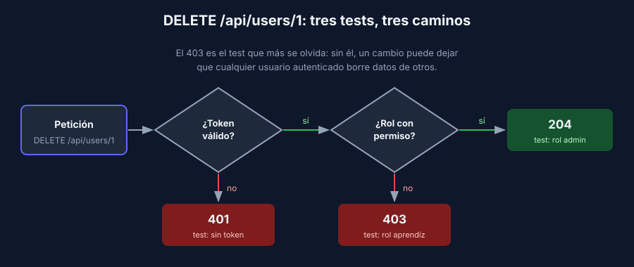

# Endpoints protegidos: autenticación y roles

> Backend: cada sección indica su stack. La app de referencia no tiene autenticación; los ejemplos muestran el patrón para que lo adaptes a tu proyecto.

## Tres casos por cada endpoint protegido

Casi todo proyecto formativo tiene inicio de sesión y roles (administrador, instructor, cliente…). Por cada endpoint protegido, prueba al menos:

| Caso | Petición | Esperado |
|---|---|---|
| Sin autenticar | Sin encabezado `Authorization` o con un token inválido | `401` |
| Rol insuficiente | Token válido de un usuario **sin** el permiso | `403` |
| Autorizado | Token válido con el permiso | `2xx` |



El caso que más se olvida es el `403`. Sin él, nadie nota cuando un cambio deja que cualquier usuario autenticado borre datos de otros.

## Dos estrategias

1. **Reemplazar al usuario actual**: el test le dice a la app "el usuario es este" sin pasar por el token. Rápido y simple; prueba los permisos, no la validación del token.
2. **Generar un token real en el test**: firmado con una clave de prueba. Prueba también el middleware o el filtro de autenticación.

Usa la 1 en la mayoría de los tests y la 2 en unos pocos (token vencido, firma inválida, sin encabezado).

## FastAPI: reemplazar la dependencia del usuario

Si tus endpoints reciben el usuario con `Depends(get_current_user)`, reemplázala igual que el repositorio:

```python
from app.auth import get_current_user


def test_delete_user_responds_403_when_user_is_not_admin(client):
    app.dependency_overrides[get_current_user] = lambda: {"id": 7, "role": "aprendiz"}

    response = client.delete("/api/users/1")

    assert response.status_code == 403


def test_delete_user_responds_401_when_there_is_no_token(client):
    # sin override de get_current_user: se ejecuta la validación real del token
    response = client.delete("/api/users/1")

    assert response.status_code == 401
```

Recuerda que el fixture `client` limpia `dependency_overrides` al terminar cada test.

## Express: firmar un token de prueba

Si tu middleware valida un JWT con una clave de `process.env`, fija una clave de prueba en la configuración de Vitest y firma tokens en el test:

```javascript
// vitest.config.js
test: {
  env: { JWT_SECRET: 'test-secret' },   // clave solo para tests, nunca la real
}
```

```javascript
import jwt from 'jsonwebtoken';

const tokenFor = (user) => jwt.sign(user, process.env.JWT_SECRET, { expiresIn: '1h' });

it('should respond 403 when user is not admin', async () => {
  const res = await request(app)
    .delete('/api/users/1')
    .set('Authorization', `Bearer ${tokenFor({ id: 7, role: 'aprendiz' })}`);

  expect(res.status).toBe(403);
});
```

Ajusta la librería (`jsonwebtoken`, `jose`) y el formato del usuario a los que usa tu middleware.

## Spring Boot: `@WithMockUser`

Con Spring Security, la dependencia `spring-security-test` (su versión la gestiona el padre de Spring Boot) permite simular el usuario autenticado:

```xml
<dependency>
    <groupId>org.springframework.security</groupId>
    <artifactId>spring-security-test</artifactId>
    <scope>test</scope>
</dependency>
```

```java
@Test
@WithMockUser(roles = "APRENDIZ")
@DisplayName("should respond 403 when user is not admin")
void shouldRespond403WhenUserIsNotAdmin() throws Exception {
    mockMvc.perform(delete("/api/users/1"))
            .andExpect(status().isForbidden());
}

@Test
@DisplayName("should respond 401 when there is no authenticated user")
void shouldRespond401WhenThereIsNoUser() throws Exception {
    mockMvc.perform(delete("/api/users/1"))
            .andExpect(status().isUnauthorized());
}
```

El `401` del segundo test supone que tu API responde así a peticiones anónimas, como es habitual en un API con JWT. Con la configuración por defecto de Spring Security (inicio de sesión por formulario) la respuesta puede ser una redirección `302`: tu test debe fijar lo que tu API promete.

`@WebMvcTest` carga tu configuración de seguridad (`SecurityFilterChain`). Si esa configuración depende de otros beans (por ejemplo, un servicio que valida el JWT), agrégalos con `@Import` o reemplázalos con `@MockitoBean`. Si tu API no desactiva CSRF, las peticiones `POST`, `PUT` y `DELETE` necesitan `.with(csrf())`.

## Qué no hacer

- ❌ Desactivar la seguridad en los tests para que "pasen": ya no estás probando lo que corre en producción.
- ❌ Usar la clave o las credenciales reales en los tests. La clave de prueba vive en la configuración de test y la real en variables de entorno del servidor.
- ❌ Probar solo el caso autorizado.

---

## Navegación

| ← Anterior | Inicio | Siguiente → |
|---|---|---|
| [Pruebas de API en cada stack](02-pruebas-de-api-por-stack.md) | [Semana 4](../README.md) | [Receta — Pruebas de API en FastAPI con `TestClient`](../2-recetas/fastapi/README.md) |
