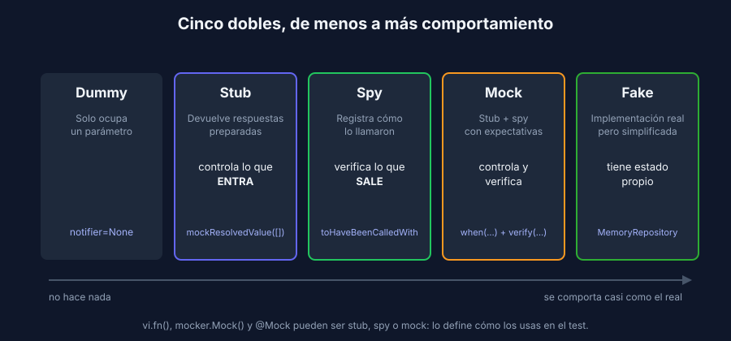

# Los cinco dobles de prueba

> Transversal: aplica a todos los stacks.

## Qué es un doble de prueba

Un **doble de prueba** reemplaza una dependencia real durante un test, como el doble de riesgo reemplaza al actor en una escena peligrosa. Lo usas cuando la dependencia real es:

- **Lenta**: una base de datos, un API externo.
- **Impredecible**: la hora actual, un número aleatorio, un servicio que a veces no responde.
- **Peligrosa o costosa**: enviar correos reales, cobrar con una pasarela de pagos.
- **Difícil de provocar**: ¿cómo haces que el servidor de correo falle justo cuando tu test lo necesita?

## Los cinco tipos



| Tipo | Qué hace | Para qué | Ejemplo en la referencia |
|---|---|---|---|
| **Dummy** | Nada. Solo ocupa un parámetro | Cumplir una firma que el test no usa | `notifier=None` en los tests del servicio que no crean piezas |
| **Stub** | Devuelve respuestas preparadas | Controlar lo que **entra** a la unidad | `fetchPieces.mockResolvedValue([])` para probar la lista vacía |
| **Spy** | Registra cómo lo llamaron | Verificar lo que **sale** de la unidad | `onSubmit = vi.fn()` y luego `toHaveBeenCalledWith(...)` |
| **Mock** | Stub + spy con expectativas | Controlar y verificar a la vez | `@MockitoBean PiecesService` + `when(...)` + `verify(...)` |
| **Fake** | Implementación real pero simplificada | Reemplazar algo con estado sin su costo | `createMemoryRepository()` y `MemoryRepository`: guardan en memoria |

En el día a día, las herramientas mezclan los nombres: `vi.fn()`, `mocker.Mock()` y `@Mock` sirven como stub, spy o mock según cómo los uses. Lo que importa es **qué rol cumplen en tu test**.

## Estado o comportamiento

Hay dos formas de verificar un resultado:

**Verificar el estado**: miras el resultado o lo que quedó guardado. Es la forma preferida.

```javascript
const piece = await service.create(guernica);
expect(piece.id).toBe(1);
```

**Verificar el comportamiento**: miras cómo la unidad usó sus dependencias. Úsalo cuando la llamada **es** el resultado que importa, como enviar una notificación, cobrar o escribir en un log de auditoría.

```javascript
await service.create(guernica);
expect(notifier.pieceCreated).toHaveBeenCalledOnce();
```

Regla práctica: verifica comportamiento solo en los **efectos hacia afuera** (notificar, pagar, publicar). Para todo lo demás, verifica estado.

## El caso de esta semana: una dependencia que falla

En la referencia, al crear una pieza el servicio avisa a un **notificador** (en un proyecto real sería un correo o un servicio externo):

```
crear pieza → validar → guardar → notificar
                                    ↑
                         si falla, la pieza ya está guardada:
                         se registra el error y la respuesta sigue siendo 201
```

Probar esa regla con el notificador real es casi imposible: tendrías que apagar el servidor de correo en medio del test. Con un **stub que lanza un error** lo provocas en una línea. Por eso existen los dobles.

Hay tres preguntas que un doble responde y el código real no:

1. ¿Se notificó **una sola vez** y con la pieza **guardada** (con su `id`)? → **spy**
2. ¿**No** se notificó cuando la pieza era inválida? → **spy** con `not.toHaveBeenCalled`
3. ¿La pieza se crea aunque el notificador **falle**? → **stub** que lanza un error

## Dobles que ya usaste

| Semana | Doble | Tipo |
|---|---|---|
| 2 | `currentYear` como parámetro | Stub del reloj, sin librerías |
| 3 | `vi.fn()` como `onSubmit` | Spy |
| 3 | `vi.mock('../src/api.js')` + `mockResolvedValue` | Stub de un módulo completo |
| 4 | Repositorio en memoria | Fake |
| 4 | `@MockitoBean PiecesService` | Mock |
| 4 | `dependency_overrides` | Mecanismo de FastAPI para inyectar cualquier doble |
