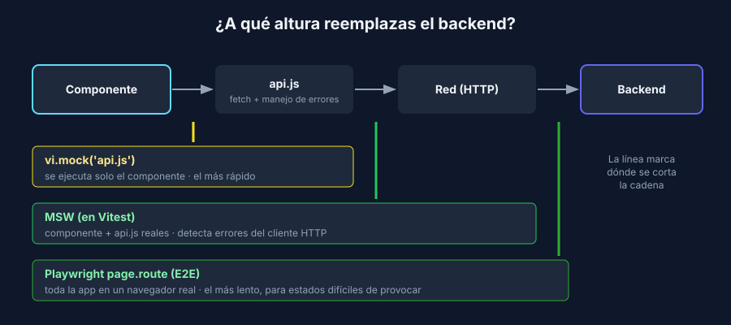

# Cuándo un doble ayuda y cuándo estorba

> Transversal: aplica a todos los stacks.

## Dónde interceptar

La misma dependencia se puede reemplazar a distintas alturas. Mientras más abajo interceptas, más código real ejecuta tu test:



| Altura | Herramienta | Código real que se ejecuta | Úsala para |
|---|---|---|---|
| Módulo | `vi.mock('../src/api.js')` | Solo el componente | Tests de componentes rápidos (semana 3) |
| Red en Node | MSW | Componente + cliente HTTP (`fetch`, manejo de errores) | Probar el cliente HTTP y los errores del API |
| Red en el navegador | Playwright `page.route` | Toda la app en un navegador real | E2E de estados difíciles de provocar: API caído, lista vacía |

`page.route` también es un doble: responde en lugar del backend. Sirve para probar en E2E lo que con el backend real es difícil de lograr:

```javascript
test('should show an error when the API fails', async ({ page }) => {
  await page.route('**/api/pieces', (route) => route.fulfill({ status: 500, body: '' }));

  await page.goto('/');

  await expect(page.getByRole('alert')).toHaveText('No se pudieron cargar las piezas');
});
```

## Señales de exceso de mocks

Un doble bien usado aísla lo que no controlas. Mal usado, el test termina verificando el **mock** y no tu código.

| Señal | Problema | Alternativa |
|---|---|---|
| El Arrange tiene 10 líneas de `when(...)` | La unidad depende de demasiadas cosas | Divide la unidad, o usa un fake |
| Verificas cada llamada interna (`verify` de todo) | El test se rompe con cualquier refactor | Verifica estado; comportamiento solo en efectos externos |
| Mockeas la función que estás probando | No estás probando nada | Mockea sus dependencias, no la unidad |
| El mock devuelve algo que el real nunca devolvería | El test pasa y producción falla | Copia respuestas reales; prefiere fakes con la lógica mínima |
| Mockeas el repositorio para probar una consulta SQL | El SQL nunca se ejecuta | Prueba de integración con BD real (semana 6) |

## No mockees lo que no es tuyo

Si tu servicio llama directamente a `nodemailer`, `smtplib`, `JavaMailSender` o al SDK de una pasarela de pagos, mockear esas librerías acopla tus tests a su API interna: cuando actualices la librería, fallan tus tests aunque tu lógica esté bien.

Mejor:

1. Crea **tu** interfaz pequeña: `notifier.pieceCreated(piece)`, `payments.charge(order)`.
2. Tu código de negocio usa esa interfaz, y en los tests se reemplaza con un doble.
3. La implementación real (la que usa la librería) es delgada y se prueba poco, con integración.

Es exactamente lo que hace la referencia con `Notifier`/`LogNotifier`, y por eso `LogNotifier` queda fuera de la medición de cobertura.

## El reloj y el azar

La semana 2 resolvió la fecha recibiéndola por parámetro. Cuando no es posible (temporizadores, tokens que vencen), las herramientas permiten controlar el tiempo:

| Stack | Herramienta |
|---|---|
| Vitest | `vi.useFakeTimers()`, `vi.setSystemTime(new Date('2026-01-01'))`, `vi.advanceTimersByTime(ms)` |
| Python | Inyectar una función `now` o un `datetime` como parámetro (lo más simple, sin librerías) |
| Java | Inyectar un `java.time.Clock` y usar `Clock.fixed(...)` en el test |

## Los dobles no ven todo

En la semana 4, `GET /api/pieces/abc` responde `404` con el repositorio falso. Contra PostgreSQL real, la misma petición en Express responde **500 con la consulta SQL**. Ningún doble lo habría detectado, porque el fake no se comporta como la base de datos en ese caso.

Por eso los dobles son la base de la pirámide, pero no la reemplazan: la semana 6 prueba contra la BD real y la 7 prueba el sistema completo.
