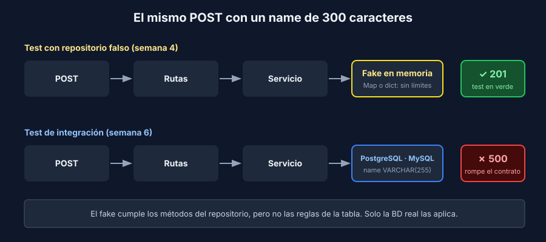

# Lo que los dobles no ven

> Transversal: aplica a todos los stacks.

## Unitaria, integración y E2E

En la semana 1 viste la pirámide. Ahora que tienes tests en las tres alturas, la diferencia se ve en **qué código real ejecuta** cada uno:

| Tipo | Código real | Reemplazado por dobles | Ejemplo en la referencia |
|---|---|---|---|
| Unitaria | Una función o clase | Todo lo demás | `validatePiece`, `PiecesService` con un fake (semanas 2 y 5) |
| API con dobles | Rutas + servicio | El repositorio | supertest, `TestClient`, MockMvc con repositorio falso (semana 4) |
| **Integración** | Tu código + **un sistema real**: la BD | Lo externo que no se prueba ahí (correo, pagos) | Esta semana |
| E2E | Todo, en un navegador | Nada (o casi) | Playwright (semanas 1 y 7) |

Una prueba de integración verifica que **tu código y la base de datos se entienden**: que el SQL es válido, que los tipos coinciden y que las restricciones se respetan.

## El caso de la semana

Envía un `POST /api/pieces` con un `name` de 300 caracteres a cualquiera de los tres backends de la referencia:



- Con el **repositorio falso**, responde `201`: el fake guarda cualquier texto en un `Map` o un `dict`.
- Contra **PostgreSQL o MySQL**, responde `500`: la columna es `VARCHAR(255)` y la BD rechaza el valor.

Los tests de la semana 4 pasan, la cobertura es alta, y el contrato se rompe en producción. El fake cumple el **contrato de métodos** del repositorio (`findById`, `create`…), pero no el **contrato de datos** de la tabla.

## Qué ve la BD real y el fake no

| Aspecto | El fake | La BD real |
|---|---|---|
| Longitud máxima | Acepta cualquier texto | `VARCHAR(255)` rechaza el valor |
| Nulos | Guarda `null` sin problema | `NOT NULL` rechaza la fila |
| Unicidad | Permite duplicados | `UNIQUE` lanza error de clave duplicada |
| Tipos | Un `Map` acepta `NaN` como llave | PostgreSQL rechaza `NaN` en una columna entera |
| Rango numérico | Cualquier número | `INTEGER` llega hasta 2 147 483 647 |
| SQL | No existe | Errores de sintaxis, columnas mal escritas, `JOIN` incorrectos |
| Relaciones | No hay llaves foráneas | No puedes borrar un padre con hijos |

Cada fila es un defecto que ningún test con dobles encuentra. Por eso la semana 5 terminaba así: los dobles son la base de la pirámide, pero no la reemplazan.

## El motor también importa

Otro caso de la referencia: `GET /api/pieces/2147483648` (un id más grande que un `INTEGER`).

| Backend | PostgreSQL | MySQL |
|---|---|---|
| Express | `500` | `404` |
| FastAPI | `500` | `404` |
| Spring Boot | `404` | `404` |

PostgreSQL rechaza el valor fuera de rango y MySQL solo compara y no encuentra la fila. Spring Boot no falla porque Hibernate crea la columna `id` como `bigint`. **El mismo código se comporta distinto según el motor.** Prueba contra el motor que usa tu proyecto, y en su versión: una BD en memoria como SQLite o H2 no te muestra estos defectos.

> ⚠️ MySQL con el modo estricto desactivado **trunca** el texto largo en silencio en lugar de rechazarlo: la pieza se guarda con el nombre cortado. MySQL 8 trae `STRICT_TRANS_TABLES` activo por defecto; verifica que tu proyecto no lo desactive.

## Dónde se corrige

Una prueba de integración **encuentra** el defecto, pero la corrección casi siempre va en otra capa. El contrato dice que un dato inválido responde `422`, así que la longitud es una **regla de negocio**:

```javascript
// Express: src/pieces-service.js
if (data.name.trim().length > 255) {
  throw new ValidationError('name must be at most 255 characters');
}
```

La regla se prueba con un test unitario (rápido, sin Docker) en su valor límite: 255 pasa, 256 no. El test de integración queda como red: si alguien cambia la columna a `VARCHAR(100)` y olvida la regla, vuelve a fallar.

> 💡 La BD es la última defensa, no la primera. Cada restricción de la tabla (`NOT NULL`, longitud, `UNIQUE`) debería tener su regla en el servicio con un error 4xx claro, y la restricción en la BD por si algo se escapa.

## Cuántas pruebas de integración

Son más lentas y necesitan Docker, así que no dupliques en integración lo que ya prueban las unitarias. Prueba en integración lo que **solo la BD puede responder**:

1. Cada método del repositorio al menos una vez: guardar, buscar, listar, borrar.
2. Las consultas propias (filtros, `JOIN`, orden, paginación).
3. Las restricciones de la tabla y cómo responde el API cuando se violan.
4. Uno o dos endpoints completos, de la petición HTTP a la fila en la BD.

Las reglas de negocio con todos sus casos borde siguen en las unitarias.
