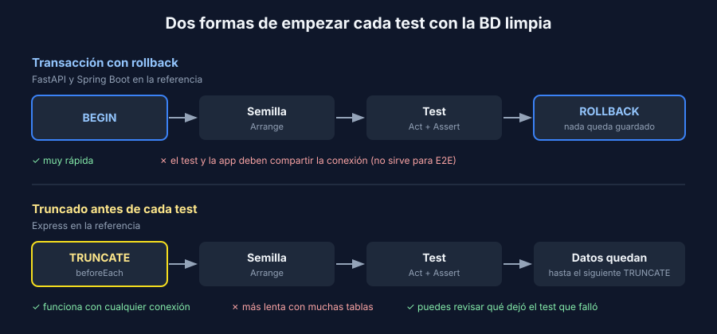

# Datos semilla y limpieza entre tests

> Transversal: aplica a todos los stacks.

## El problema: la BD recuerda

Con el repositorio falso, cada test creaba uno nuevo y empezaba de cero. La BD real **guarda todo** entre tests y entre corridas. Si un test crea una pieza y no la borra:

- El test que cuenta las piezas espera 1 y encuentra 2.
- El resultado depende del **orden** en que corren los tests.
- La suite pasa la primera vez y falla la segunda.

Es la **I** de FIRST (independientes) y la **R** (repetibles), ahora con una BD de por medio.

## Regla 1: cada test prepara sus datos

El Arrange inserta exactamente lo que el test necesita. Nada de "ya había una pieza con id 1 en la BD".

```javascript
// Express (Vitest): el test crea su pieza y usa el id que devolvió la BD
const created = await repository.create({ name: 'Guernica', artist: 'Picasso', year: 1937 });

const found = await repository.findById(created.id);

expect(found).toEqual(created);
```

No escribas ids fijos en las aserciones (`expect(piece.id).toBe(1)`): el id lo decide la BD y depende de lo que se insertó antes. Usa el que devolvió el `create`.

## Regla 2: limpia entre tests

Hay dos estrategias, y las recetas usan las dos:



| | Transacción con rollback | Truncado |
|---|---|---|
| Cómo | Abre una transacción antes del test y la deshace al final | Vacía las tablas antes de cada test |
| Velocidad | Muy rápida: nada llega a escribirse | Más lenta: la BD borra de verdad |
| Límite | El test y la app deben usar **la misma conexión** | Ninguno: funciona con cualquier conexión |
| No sirve si… | La app corre en otro proceso (E2E) o abre sus propias conexiones | Hay muchas tablas grandes (se vuelve lenta) |
| En la referencia | FastAPI (`join_transaction_mode`) y Spring Boot (`@Transactional`) | Express (`db('pieces').truncate()`) |

### Rollback

Todo lo que hace el test ocurre dentro de una transacción que nunca se confirma. En Spring Boot basta una anotación, porque `@DataJpaTest` ya es transaccional:

```java
// Spring Boot: cada test hace rollback al terminar
@DataJpaTest
@AutoConfigureTestDatabase(replace = Replace.NONE)  // usa DATABASE_URL, no una BD en memoria
class PieceRepositoryIntegrationTest { /* ... */ }
```

Ojo: el código bajo prueba también maneja transacciones (`SqlRepository.create` en FastAPI hace `commit()`). Si hace un `rollback()` por su cuenta, puede cerrar la transacción del test, y lo que guarde después queda en la BD para siempre. La solución es que la sesión convierta sus `commit()` y `rollback()` en *savepoints* dentro de la transacción del test. La receta de FastAPI muestra cómo.

### Truncado

Antes de cada test se vacía la tabla. Limpia **antes** y no después: si un test falla a mitad de camino, el siguiente igual empieza limpio.

```javascript
// Express (Vitest)
beforeEach(async () => {
  await db('pieces').truncate();  // PostgreSQL: además reinicia el contador de ids
});
```

Con llaves foráneas, ninguno de los dos motores deja truncar una tabla padre por separado, aunque la hija esté vacía. En PostgreSQL trunca todas en una sola sentencia (`TRUNCATE comments, posts`). En MySQL usa `DELETE`, primero en las hijas y después en las padres.

## Regla 3: un archivo a la vez

Vitest y pytest con plugins pueden correr archivos en paralelo. Con una sola BD, dos archivos que truncan la misma tabla se borran los datos entre sí y fallan al azar. Para la integración, corre los archivos en serie:

```javascript
// Express: vitest.config.js
test: { fileParallelism: false }
```

pytest y JUnit corren en serie por defecto; no actives el paralelismo en los tests de integración.

## La prueba de fuego: dos corridas seguidas

Una suite de integración bien aislada pasa:

1. Dos veces seguidas, sin reiniciar la BD.
2. En cualquier orden (Vitest: `--sequence.shuffle`; JUnit: `@TestMethodOrder(MethodOrderer.Random.class)`).
3. Con la BD recién creada (`docker compose down -v` y `up`).

Si falla en alguna, un test depende de datos que no preparó o deja datos que no limpió.

## Qué no hacer

| Mala práctica | Por qué falla | Mejor |
|---|---|---|
| Un script SQL de semilla gigante compartido por todos los tests | Cambiar un dato rompe tests que no tienen nada que ver | Cada test inserta lo suyo, con una función de ayuda |
| Tests que se encadenan (el 2 usa lo que creó el 1) | Si el 1 falla, fallan todos; no se pueden correr solos | Cada test hace su propio Arrange |
| Limpiar solo al final | Un test que falla deja basura para el siguiente | Limpia en el `beforeEach` |
| `sleep` para esperar a la BD | Lento y aun así falla en equipos lentos | `docker compose up --wait` y el healthcheck |
