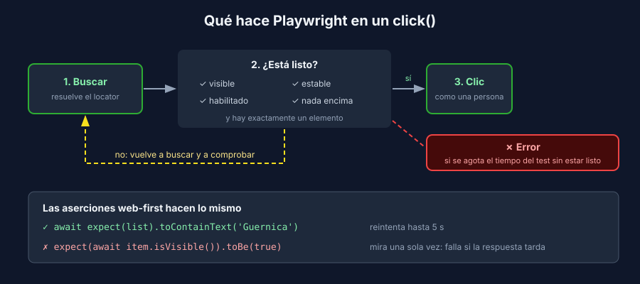

# Locators y esperas: cómo piensa Playwright

> Común a todos los stacks: los E2E prueban la app desde el navegador, sin importar el backend.

## El locator es una búsqueda, no un elemento

Un **locator** describe *cómo encontrar* algo en la página. No busca nada hasta que lo usas, y cada vez que lo usas vuelve a buscar:

```javascript
// Playwright: nada se busca todavía
const saveButton = page.getByRole('button', { name: 'Guardar' });

await saveButton.click();   // busca aquí, espera a que se pueda hacer clic, y hace clic
```

Por eso un locator sobrevive a los re-renders de React: si el botón se vuelve a dibujar, el siguiente uso encuentra el nuevo.

## Qué locator usar

La prioridad es la misma de React Testing Library (semana 3): primero lo que una persona percibe.

| Prioridad | Locator | Ejemplo |
|:---:|---|---|
| 1 | `getByRole` con nombre accesible | `getByRole('button', { name: 'Guardar' })` |
| 2 | `getByLabel` para campos de formulario | `getByLabel('Nombre')` |
| 3 | `getByText` para contenido no interactivo | `getByText('Aún no hay piezas registradas.')` |
| 4 | `getByTestId`, cuando no hay nada accesible | `getByTestId('map-canvas')` |
| Último | CSS o XPath | `locator('.btn-primary')`: se rompe cuando cambia el diseño |

Para acotar, encadena y filtra en lugar de escribir selectores largos:

```javascript
const list = page.getByRole('list', { name: 'Piezas' });
const guernica = list.getByRole('listitem').filter({ hasText: 'Guernica' });
```

Los locators son **estrictos**: si `getByRole('button', { name: 'Guardar' })` encuentra dos botones, la acción falla con un error que los muestra. Es a propósito: prefieres un error claro a un clic en el botón equivocado.

## Auto-waiting: las acciones esperan solas

Antes de cada acción, Playwright comprueba que el elemento esté listo y reintenta hasta que lo está o se acaba el tiempo:



| Acción | Espera a que el elemento esté… |
|---|---|
| `click()` | visible, estable (sin animación), habilitado y sin otro elemento encima |
| `fill()` | visible, habilitado y editable |
| `check()` | visible, estable, habilitado y sin otro elemento encima |

Por eso **nunca** necesitas `page.waitForTimeout(2000)` antes de un clic. Una pausa fija es lenta cuando la app es rápida y se queda corta cuando es lenta.

## Aserciones que esperan (web-first)

Las aserciones sobre un locator también reintentan, hasta 5 segundos por defecto:

```javascript
// ✓ Reintenta hasta que la lista contiene el texto
await expect(page.getByRole('list', { name: 'Piezas' })).toContainText('Guernica');

// ✗ Lee el estado UNA vez: si la respuesta del API aún no llega, falla
expect(await page.getByText('Guernica').isVisible()).toBe(true);
```

La segunda forma es la causa más común de tests que "a veces fallan". Si ves `await` **dentro** de `expect(...)`, sospecha.

| Quieres verificar | Aserción web-first |
|---|---|
| Que algo se ve / ya no se ve | `toBeVisible()` / `toBeHidden()` |
| Un texto exacto o parcial | `toHaveText()` / `toContainText()` |
| Cuántos elementos hay | `toHaveCount(n)` |
| Un campo | `toHaveValue()`, `toBeEnabled()`, `toBeDisabled()` |
| La URL | `expect(page).toHaveURL(/\/piezas\/\d+/)` |

## Lo que no se espera solo

El auto-waiting mira **la página**, no tu backend ni tu BD. Si el test necesita que exista una pieza, créala antes (teoría 3). Y si la app responde bien pero **tarde**, Playwright espera; si responde **mal** por culpa del tiempo, eso ya no es un problema de esperas: es un defecto (teoría 2).

## Resumen de malas prácticas

| En el test | Problema | Mejor |
|---|---|---|
| `await page.waitForTimeout(3000)` | Lento y aun así falla en equipos lentos | Una aserción web-first sobre lo que esperas ver |
| `expect(await locator.textContent()).toBe(...)` | Lee una sola vez | `await expect(locator).toHaveText(...)` |
| `page.locator('div > ul > li:nth-child(2)')` | Se rompe al cambiar el HTML | `getByRole('listitem').filter({ hasText })` |
| `page.locator('#root .card button')` | No dice qué hace el botón | `getByRole('button', { name: '...' })` |
| `{ force: true }` en un clic | Salta las comprobaciones y esconde defectos reales | Averigua qué tapa o deshabilita el elemento |
