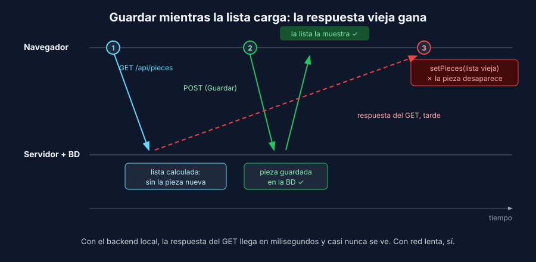

# Flaky o defecto: los tiempos importan

> Común a todos los stacks.

## Qué es un test flaky

Un test **flaky** (inestable) pasa y falla sin que cambie el código. Es peor que no tener test: el equipo aprende a ignorar el rojo ("vuelve a correrlo, a veces falla") y el día que falla por un defecto real, nadie mira.

Antes de culpar al test, hazte una pregunta: **¿el fallo describe algo que le podría pasar a una persona usuaria?** Si la respuesta es sí, no es un test flaky: es un defecto que solo aparece con ciertos tiempos.

## Causas frecuentes

| Causa | Síntoma | Solución |
|---|---|---|
| Pausas fijas o lecturas únicas | Falla en el CI o en equipos lentos | Aserciones web-first (teoría 1) |
| Datos compartidos | Falla según qué corrió antes o en paralelo | Cada test crea sus datos con valores únicos (teoría 3) |
| Depender del orden | Pasa la suite completa, falla un test solo | Nada de tests encadenados |
| Datos que ya había en la BD | Pasa en tu equipo, falla en el de otro | BD de pruebas desechable (semana 6) |
| Fechas y horas reales | Falla a medianoche o a fin de mes | Fija la hora con `page.clock` |
| **Un defecto de concurrencia de la app** | Falla con red lenta o clics rápidos | **Corrige la app**, no el test |

## Cómo detectarlo

```bash
pnpm exec playwright test --repeat-each=10          # cada test 10 veces
pnpm exec playwright test --retries=2               # reintenta; los que pasan al reintentar salen como "flaky"
pnpm exec playwright test --fail-on-flaky-tests     # un test flaky hace fallar la corrida
```

Los reintentos sirven para **ver** la inestabilidad, no para esconderla. Un test marcado como *flaky* es una tarea pendiente, no un test aprobado.

## Dos defectos de tiempos en la referencia

La app de referencia pasa todos los tests de las semanas 1 a 6. Aun así tiene dos defectos que solo aparecen en un navegador real.

### Doble envío

Una persona impaciente hace doble clic en **Guardar**. El formulario envía dos `POST` y la pieza queda registrada **dos veces**. El botón sigue habilitado mientras la primera petición está en camino. En un proyecto ADSO pasa lo mismo con un pago, una reserva o una inscripción.

```javascript
// Playwright: el doble clic es una acción más
await page.getByRole('button', { name: 'Guardar' }).dblclick();
```

### La pieza que desaparece

Si guardas **mientras la lista todavía carga**, la pieza se guarda en la BD, aparece en la pantalla… y un instante después desaparece:



1. La página pide la lista (`GET`). El servidor la calcula: aún no está la pieza nueva.
2. La persona guarda (`POST`). La pieza se crea y la app la agrega a la lista.
3. Llega la respuesta del `GET`, calculada **antes** del `POST`, y la app **reemplaza** la lista con ella.

En tu equipo, con el backend local, el `GET` responde en milisegundos y casi nunca lo verás. Con el wifi del ambiente de formación o con datos móviles, sí.

## De "a veces" a "siempre"

Un defecto de tiempos no se prueba esperando a que ocurra por suerte. Se **provoca**. `page.route` (semana 5) no solo reemplaza respuestas: también puede dejar pasar la petición al servidor real y **retrasar** la respuesta:

```javascript
// Playwright: el GET llega al servidor ahora, pero su respuesta se entrega 1.5 s después
await page.route('**/api/pieces', async (route) => {
  if (route.request().method() !== 'GET') return route.continue();
  const response = await route.fetch();
  await new Promise((resolve) => setTimeout(resolve, 1500));
  await route.fulfill({ response });
});
```

El `setTimeout` aquí **no** es una pausa del test: es la latencia de red simulada. El test sigue sin esperar tiempos fijos; sus aserciones son web-first.

Con este retraso, el defecto aparece en cada corrida. Ahora el test es un buen test: falla siempre mientras el defecto exista y pasa siempre cuando se corrige.

## Dónde se corrige

En la app, no en el test:

| Defecto | Corrección |
|---|---|
| Doble envío | Deshabilitar el botón mientras se guarda (y, en el backend, idempotencia para operaciones críticas como pagos) |
| Lista que borra la pieza | Al recibir la lista, combinarla con las piezas creadas mientras cargaba, en lugar de reemplazarla |

> ⚠️ Nunca "arregles" un defecto de tiempos agregando `waitForTimeout` al test para que la app termine de cargar antes del clic. El test queda en verde y la persona usuaria sigue perdiendo su pieza.

---

## Navegación

| ← Anterior | Inicio | Siguiente → |
|---|---|---|
| [Locators y esperas: cómo piensa Playwright](01-locators-y-esperas.md) | [Semana 7](../README.md) | [Datos por API y objeto de página](03-datos-y-objeto-de-pagina.md) |
