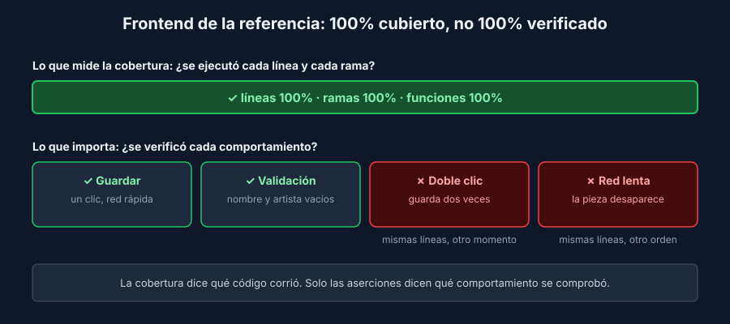

# Qué mide la cobertura (y qué no)

> Transversal: aplica a todos los stacks.

## Cuatro números distintos

El reporte de cobertura muestra varias columnas. No miden lo mismo:

| Métrica | Pregunta que responde | Herramientas |
|---|---|---|
| **Líneas** / sentencias | ¿Qué líneas se **ejecutaron** durante los tests? | Todas |
| **Ramas** | ¿Se tomó **cada camino** de cada `if`, `?:`, `&&`, `catch`? | Vitest (v8), pytest-cov con `--cov-branch`, JaCoCo |
| **Funciones** | ¿Se llamó cada función al menos una vez? | Vitest, JaCoCo (métodos) |

Una línea con un `if` puede estar cubierta aunque solo se haya probado uno de sus dos caminos. Por eso la cobertura de **ramas** es más exigente que la de líneas.

## La rama sin cubrir es una pista

Corre `pnpm test` en [`referencia/api-express`](../../../referencia/api-express/) y mira la fila de `app.js`:

```text
File               | % Stmts | % Branch | % Funcs | % Lines | Uncovered Line #s
 app.js            |      95 |       80 |     100 |   94.44 | 34
```

La línea 34 es el `next(err)` del manejador de errores: el camino de **cualquier error que no sea de validación ni de "no encontrado"**. Es exactamente por donde salen el HTML del JSON mal formado (semana 4) y los `500` con la consulta SQL (semana 6). La herramienta lo marcaba desde la semana 1. Nadie preguntó qué comportamiento había detrás de ese número.

> 💡 Ante una rama sin cubrir, no preguntes "¿qué test sube el porcentaje?". Pregunta: **¿qué le pasa a la persona usuaria cuando el código toma ese camino?**

## 100% de cobertura, dos defectos

El frontend de la referencia tiene **100%** en las cuatro columnas:

```text
Statements   : 100% ( 30/30 )
Branches     : 100% ( 18/18 )
Functions    : 100% ( 10/10 )
Lines        : 100% ( 26/26 )
```

Y aun así tiene los dos defectos de la semana 7: el doble clic registra dos piezas, y una pieza guardada mientras la lista carga desaparece. Cada línea de `PieceForm.jsx` y de `App.jsx` se ejecuta en algún test. Ninguno prueba un doble clic ni una respuesta que llega tarde.



La cobertura responde **qué código se ejecutó**. No responde:

| La cobertura no sabe… | Ejemplo en la referencia |
|---|---|
| Si el test **verificó** algo | Un test sin aserciones cubre igual que uno bueno |
| Si probó el **valor límite** | `year > currentYear` cubierto con 1937 y 2027, sin 2026 (semana 2) |
| Qué pasa con **otros datos** | Un `name` de 256 caracteres pasa por las mismas líneas que uno de 8 (semana 6) |
| Qué pasa con **otros tiempos** | Doble clic, respuesta tardía (semana 7) |
| Qué pasa con el **sistema real** | El fake y la BD real ejecutan el mismo servicio (semana 6) |
| Lo que está **excluido** | `knex-repository.js`, `repository.py`: fuera de la medición a propósito |
| Lo que se **saltó** | Un test *skipped* no cubre nada |

## La cobertura es un piso, no una meta

Para qué **sí** sirve:

- **Encontrar código sin probar**: un 0% en un archivo con reglas de negocio es una alarma real.
- **Evitar retrocesos**: el umbral en el CI impide que un PR agregue código sin tests (por eso es un trinquete).
- **Señalar caminos olvidados**: las ramas sin cubrir, leídas como en la sección anterior.

Lo que **no** hay que hacer:

| Atajo | Por qué engaña |
|---|---|
| Tests que llaman funciones sin `expect` | Cobertura alta, cero verificación |
| Excluir archivos con lógica para llegar al número | El número sube, el riesgo no baja |
| Perseguir el 100% | Los últimos puntos cuestan mucho y aportan poco; mejor probar límites y errores |

## La medida de fondo: mutación

En la semana 2 hiciste **mutaciones a mano**: cambiar `>` por `>=` y ver si algún test fallaba. Esa es la pregunta que la cobertura no responde: **si rompo el código, ¿algún test se entera?**

Existen herramientas que lo automatizan: generan cientos de mutantes y reportan cuántos sobreviven.

| Stack | Herramienta |
|---|---|
| JavaScript | [Stryker](https://stryker-mutator.io/) |
| Python | [mutmut](https://mutmut.readthedocs.io/) |
| Java | [PIT](https://pitest.org/) |

Son lentas para correr en cada PR, pero una corrida semanal sobre las reglas de negocio muestra qué tests son de adorno. En este bootcamp seguimos con mutaciones a mano en cada PR: son pocas, elegidas, y cada integrante sabe explicar por qué su test las mata.
