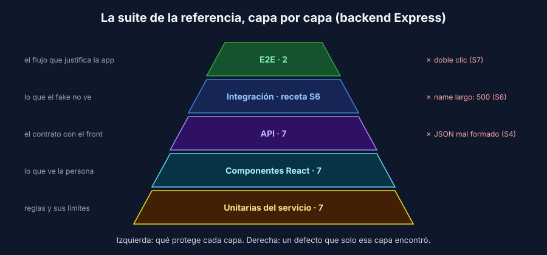

# La estrategia de pruebas de tu proyecto

> Transversal: aplica a todos los stacks.

## Qué es y para quién

Una **estrategia de pruebas** explica qué se prueba en un proyecto, en qué capa y **por qué**. No es la lista de tests (esa la da el runner) ni el manual de las herramientas. Es el documento que lee alguien que llega nuevo al equipo, o el jurado de una sustentación, para entender en cinco minutos qué protege la suite y qué no.

Una buena estrategia responde cuatro preguntas:

1. ¿Qué **no puede fallar** en esta app?
2. ¿Qué capa de pruebas cuida cada riesgo, y por qué esa y no otra?
3. ¿Qué queda **fuera** a propósito?
4. ¿Qué encontraron las pruebas, y qué sigue abierto?

## La forma de la suite es una decisión

En la semana 1 viste la pirámide: muchas unitarias, menos de integración, pocas E2E. Es un punto de partida, no una regla. La forma correcta depende de **dónde vive la lógica** de tu proyecto.

Así se ve la suite de la referencia:

| Si en tu proyecto… | La suite tiende a… |
|---|---|
| Las reglas viven en servicios (validaciones, cálculos, estados) | Muchas unitarias del servicio, como la referencia |
| Casi todo es CRUD y la lógica está en las consultas | Más integración con la BD que unitarias |
| La complejidad está en la interfaz (formularios, estados de carga) | Más tests de componentes |
| Un solo flujo concentra el valor (pagar, inscribirse) | Ese flujo con E2E aunque la suite sea pequeña |

Lo que no se acepta en el informe es copiar la pirámide genérica sin decir por qué aplica a **tu** proyecto.

## Las secciones del informe

La [plantilla](../../../plantillas/estrategia-pruebas.md) tiene siete secciones. El [ejemplo sobre la referencia](../../../referencia/ESTRATEGIA.md) las llena con datos reales.

| Sección | Qué debe tener | Error frecuente |
|---|---|---|
| 1. Qué no puede fallar | Riesgos desde la persona usuaria | Listar funcionalidades en vez de riesgos |
| 2. Qué prueba cada capa | Qué verifica, herramienta, cantidad y **por qué esta forma** | Solo nombres de herramientas |
| 3. Qué no se prueba | Cada exclusión con su motivo | Esconder exclusiones que inflan la cobertura |
| 4. Datos y entornos | BD de pruebas, dobles, datos de los E2E | Omitir cómo se limpia la BD |
| 5. CI y umbrales | Enlace al run, jobs obligatorios, cobertura | Solo el porcentaje, sin enlace verificable |
| 6. Hallazgos y riesgos | Defectos encontrados y su estado | Decir "no encontramos nada" |
| 7. Evidencia individual | Capas por integrante y commits | Una sola persona con todos los commits |

## Los hallazgos son la mejor evidencia

Un informe que dice "todos los tests pasan" no dice nada: una suite vacía también pasa. Lo que demuestra que la suite sirve es lo que **encontró**. En la referencia:

| Hallazgo | Capa |
|---|---|
| JSON mal formado responde HTML fuera del contrato | API (semana 4) |
| `name` largo responde `500` contra la BD real | Integración (semana 6) |
| Doble clic registra la pieza dos veces | E2E (semana 7) |

Cada grupo tiene los suyos en los PR del trimestre. Búsquenlos y llévenlos al informe, con el enlace al PR que los corrigió o a la incidencia abierta.

## Dos páginas, no veinte

El informe se lee en la sustentación. Si no cabe en dos páginas, sobra detalle: las tablas de la plantilla ya son el resumen. Todo lo que el informe afirme debe poder comprobarse en el repo: un número de tests, un porcentaje, un enlace a un run del CI.

---

## Navegación

| ← Anterior | Inicio | Siguiente → |
|---|---|---|
| [Semana 9 — Integrador](../README.md) | [Semana 9](../README.md) | [La sustentación: responder por todas las capas](02-sustentacion.md) |
