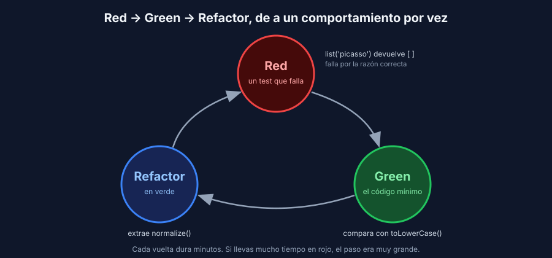

# El ciclo Red-Green-Refactor

> Transversal: aplica a todos los stacks.

## Primero el test

En TDD escribes el test **antes** que el código que lo hace pasar. No es solo cambiar el orden: el test se convierte en la especificación del siguiente paso, y el código crece de a un comportamiento por vez.



| Fase | Qué haces | Qué **no** haces |
|---|---|---|
| **Red** | Escribes **un** test para el siguiente comportamiento y lo ves fallar | Escribir varios tests a la vez; tocar el código de producción |
| **Green** | Escribes el código **mínimo** para que ese test pase | Mejorar el diseño; agregar lo que "seguro se va a necesitar" |
| **Refactor** | Mejoras nombres, duplicación y estructura del código **y** de los tests, con la suite en verde | Agregar comportamiento nuevo |

Cada vuelta dura minutos, no horas. Si llevas media hora en rojo, el paso era demasiado grande: deshaz y elige un caso más pequeño.

## Red por la razón correcta

Un test en rojo solo sirve si falla porque **el comportamiento todavía no existe**. Lee siempre el mensaje:

| El test falla con… | ¿Es el Red que buscas? |
|---|---|
| `expected [ ... ] to deeply equal [ ... ]` / `assert [...] == [...]` | Sí: el código responde, pero no lo que pides |
| `TypeError: PiecesService.list() takes 1 positional argument but 2 were given` (Python) | Sí, en el primer ciclo: el método todavía no recibe el dato |
| Error de compilación `method list ... cannot be applied to given types` (Java) | Sí, en el primer ciclo: en un lenguaje compilado, "no compila" también es rojo |
| `Cannot find module`, `ImportError`, un error de sintaxis en el test | **No**: el test está mal escrito. Corrígelo antes de seguir |

Si un test nuevo **pasa** apenas lo escribes, algo anda mal: o el comportamiento ya existía, o el test no verifica lo que crees. Nunca empieces un Green sin haber visto el Red.

## Green: el mínimo

El código del Green puede ser ingenuo. En el primer ciclo de la receta, el filtro compara el artista con `===`, sin mayúsculas ni espacios, porque ningún test pide más todavía. El siguiente test ("sin importar mayúsculas") es el que obliga a mejorarlo.

Esto se siente raro al principio: sabes que el código está incompleto. Es a propósito. Cada línea de producción existe porque un test la pidió, así que cada línea tiene un test que falla si la borras. Es la mutación de la semana 2, pero al revés: **no hay mutantes que sobrevivan porque no hay código sin test**.

## Refactor: con la red puesta

Con todo en verde, mejoras el diseño sin cambiar el comportamiento. La suite es tu red: si algo se pone rojo durante el refactor, deshaz el último cambio.

En la receta, después de cuatro ciclos el servicio tiene la misma normalización (`trim` + minúsculas) escrita dos veces. El refactor la extrae a una función `normalize`. Y los tres tests casi idénticos (`'Picasso'`, `'picasso'`, `'  Picasso '`) se juntan en un test parametrizado. **Los tests también se refactorizan.**

## La evidencia en Git

El ciclo deja rastro si haces commits pequeños:

```text
test: filter pieces by artist (red)
feat: filter pieces by artist
test: ignore case when filtering by artist (red)
feat: ignore case when filtering by artist
refactor: extract normalize for artist names
```

Un commit con un test en rojo rompe el CI si lo subes solo. Trabaja en una rama y haz push cuando el ciclo esté en verde: el historial conserva el orden aunque el CI solo vea el último commit.

## Cuándo sí y cuándo no

| TDD ayuda mucho | TDD ayuda poco |
|---|---|
| Reglas de negocio con casos claros (validaciones, cálculos, filtros) | Explorar una librería o un diseño visual que todavía no conoces |
| Corregir un defecto: primero el test que lo reproduce | Código que es solo configuración o conexión |
| Cambiar código que otros usan (el test fija el contrato) | Prototipos que vas a tirar |

Aunque no hagas TDD siempre, hay una costumbre que vale para todo el bootcamp: **ante un defecto, primero el test que lo reproduce**. Es lo que hiciste en las semanas 4, 6 y 7.
